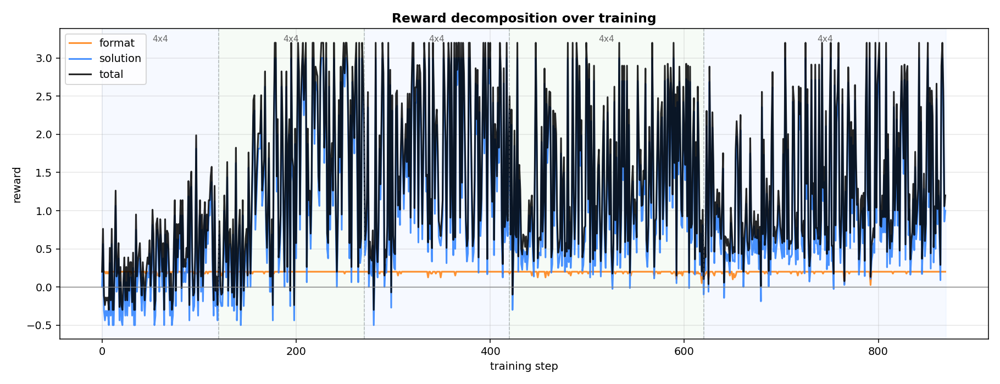

# Results & Analysis

A full account of what was tried, what failed, why, and what finally worked. Figures
and tables are regenerated by `scripts/plot.py`; auto-generated narrative lives in
[`../results/observations.md`](../results/observations.md) and the before/after table
in [`../results/comparison.md`](../results/comparison.md).

## 1. Setup

- **Model:** Qwen2.5-3B-Instruct, 4-bit, LoRA rank 32.
- **Algorithm:** GRPO, group size 8, dense verifiable reward, LR 1e-5.
- **Hardware:** one RTX 4090 (24 GB), vLLM colocated with training.
- **Eval:** exact-solve rate on 100 freshly generated puzzles per difficulty (disjoint
  seed), greedy decoding, parsed by the same `rewards.score` used in training.

## 2. Attempt 1 — full-difficulty curriculum (FAILED)

The first configuration (`configs/curriculum.yaml`: 4×4→6×6→9×9, normal clue counts,
LR 5e-6, 100/150/200 steps) **made the model worse**:

| Size | Solve before | Solve after | Cell acc before → after | Format before → after |
|---|---|---|---|---|
| 4×4 | 0% | 1% | 27% → 31% | 99% → 97% |
| 6×6 | 0% | 0% | 15% → 11% | 93% → 65% |
| 9×9 | 0% | 0% | 12% → 10% | 81% → 70% |

Diagnosis from the training logs:

- **The policy barely moved** — KL to reference stayed at 0.001–0.007 throughout. LR
  5e-6 over a few hundred 1-prompt updates is simply not enough optimization.
- **The solve-bonus signal never fired on 6×6/9×9** — `solved` was 0.000 for every
  logged step, so only the dense cell-accuracy term had gradient, and it plateaued.
- **Format collapsed on big boards** — completion length grew into the token cap, so
  answers were truncated before the closing `</answer>` and became unparseable.

## 3. Why — the base model can't reason Sudoku

Reading actual completions explained the zero signal. The base model's CoT is
**confabulated**:

> "Now, looking at the first column: 2 1 3 4 … so the first column becomes: **2 1 1 4**."

It states the no-repeat rule and immediately violates it. A difficulty sweep of the
base model quantified the competence cliff (`difficulty_sweep_base.json`):

| Puzzle | Empty cells | Base solve rate |
|---|---|---|
| 4×4 | 1 | 7% |
| 4×4 | 2 | 0% |
| 4×4 | 3 | 3% |
| 4×4 | ≥4 | 0% |
| 9×9 | 4 | 4% |
| 6×6 / 9×9 | more | 0% |

Even a 4×4 with a **single forced empty cell** is solved only 7% of the time — the
model corrupts the *given* cells while transcribing. RLVR cannot amplify a signal that
is essentially zero, which is exactly why Attempt 1 failed.

### Direct vs CoT (A/B)

Could removing the rambling help? No:

| 4×4, 1 empty | solve | format |
|---|---|---|
| CoT | 9% | 90% |
| Direct (grid only) | **0%** | 100% |

Direct-answer formats perfectly but never solves — the model needs to reason
(imperfectly) to fill anything. **CoT stays.**

## 4. Attempt 2 — start trivial, work up (WORKED)

The fix follows directly from the cliff: **bootstrap where the base can already
occasionally succeed** (4×4, 1 empty, ~9%), then ramp difficulty one empty cell at a
time, carrying LoRA forward (`configs/easy_curriculum.yaml`).

### Per-stage climb

| Stage | Empty cells | solved (first 10 → last 10 steps) | peak |
|---|---|---|---|
| 0 | 1 | 2% → 20% | 62% |
| 1 | 2 | 16% → 59% | 100% |
| 2 | 3 | 22% → 44% | 100% |
| 3 | 5 | 31% → 28% | 100% |
| 4 | 7 | 28% → 39% | 100% |

Each stage shows GRPO amplifying the sparse solve signal; groups hitting 100% solved
appear from stage 1 onward.

### Before vs after (the headline)

| Puzzle | Empty cells | Before | After | Δ |
|---|---|---|---|---|
| 4×4 | 1 | 7% | **99%** | +92% |
| 4×4 | 2 | 0% | **93%** | +93% |
| 4×4 | 3 | 3% | **86%** | +83% |
| 4×4 | 4 | 0% | **73%** | +73% |
| 4×4 | 6 | 0% | **46%** | +46% |
| 4×4 | 8 (full) | 0% | **32%** | +32% |
| 6×6 | 2 | 0% | 17% | +17% |
| 6×6 | 4 | 0% | 4% | +4% |
| 9×9 | 4 | 4% | 19% | +15% |
| 9×9 | 8 | 0% | 3% | +3% |

### Two things worth emphasizing

1. **Graceful difficulty falloff.** After training, the solve rate decays *smoothly*
   with empty cells (99→93→86→73→46→32%). The model didn't memorize; it acquired a
   capability that degrades with problem hardness, as a real solver's would.
2. **Zero-shot transfer.** Training touched **only 4×4**, yet 6×6 and 9×9 instances
   improve (9×9/4-empty 4%→19%). The LoRA learned transferable
   copy-the-givens-and-respect-constraints behavior, not board-specific lookup.

## 5. Interpretation

- This is the realistic meaning of "frontier on a narrow task" on a 4090: a model that
  was **incapable** (≈0%) becomes **highly capable on the scoped task** (99% on easy
  4×4), via RLVR — no labels, just a verifiable reward.
- The decisive lesson is about **bootstrapping**: RLVR amplifies, it does not create.
  You must start the curriculum where the base model's success rate is non-zero. The
  failed first run and the difficulty sweep together pin down exactly where that is.

## 6. Limitations

- **Single seed, single GPU, ~2 h budget.** A faithful case study, not a benchmark.
- **Hard boards remain hard.** Full 6×6/9×9 are still near 0%; reaching them would need
  far more steps (and likely a stronger base), consistent with the bootstrap argument.
- **CoT is unfaithful.** The model solves more than it "reasons" correctly; the reward
  only checks the final grid, so improvements are in answers, not necessarily in
  legible reasoning.
- **The failed config is kept** (`configs/curriculum.yaml`) so the negative result and
  its diagnosis stay reproducible.
