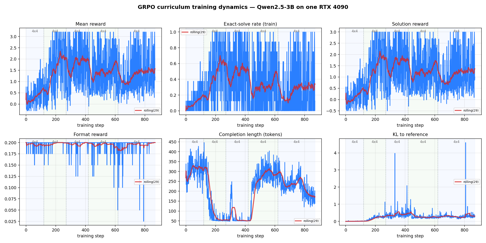
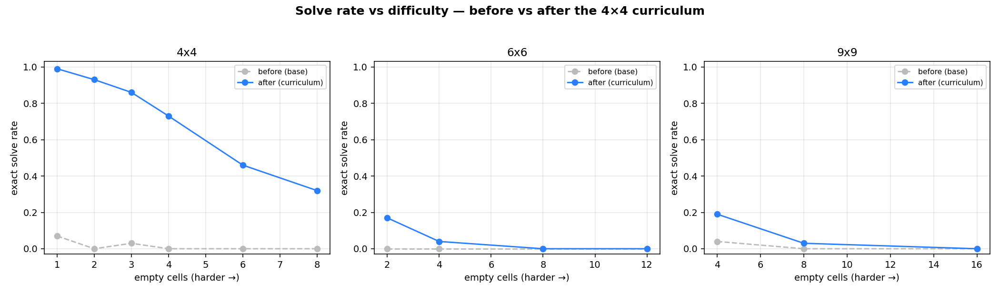

# Results

Figures and tables are regenerated by `scripts/plot.py` and
`scripts/log_experiment.py`; see also [`../results/comparison.md`](../results/comparison.md)
and [`../results/observations.md`](../results/observations.md).

## Setup

- Model: Qwen2.5-3B-Instruct, 4-bit, LoRA rank 32.
- Algorithm: GRPO, group size 8, verifiable reward.
- Hardware: one RTX 4090 (24 GB), vLLM colocated with training.
- Evaluation: exact-solve rate on 100 held-out puzzles per difficulty, greedy
  decoding, scored by the same `rewards.score` used in training.

## Size-based curriculum (negative result)

The first configuration (`configs/curriculum.yaml`: 4×4 → 6×6 → 9×9 at standard clue
counts, LR 5e-6) did not improve solve rate:

| Size | Solve before | Solve after | Cell accuracy | Format |
|---|---|---|---|---|
| 4×4 | 0% | 1% | 27% → 31% | 99% → 97% |
| 6×6 | 0% | 0% | 15% → 11% | 93% → 65% |
| 9×9 | 0% | 0% | 12% → 10% | 81% → 70% |

From the training logs: KL to the reference stayed at 0.001–0.007 (the policy barely
moved), `solved` was 0 for every logged step on 6×6/9×9 (the solve reward never fired),
and completion length grew into the token cap so some answers were truncated before the
closing `</answer>` tag.

## Base-model difficulty profile

A difficulty sweep of the base model (`difficulty_sweep_base.json`) shows where it can
occasionally solve a puzzle:

| Puzzle | Empty cells | Base solve rate |
|---|---|---|
| 4×4 | 1 | 7% |
| 4×4 | 2 | 0% |
| 4×4 | 3 | 3% |
| 4×4 | ≥4 | 0% |
| 9×9 | 4 | 4% |
| larger | more | 0% |

A 4×4 with one forced empty cell is solved 7% of the time; the model often corrupts the
given cells while transcribing the grid. Below this, the solve reward is essentially
never triggered.

The direct-answer prompt (grid only, no reasoning) reaches 100% format but 0% solve, so
reasoning is kept in the prompt.

## Difficulty curriculum

`configs/easy_curriculum.yaml` starts at one empty cell and adds one per stage, carrying
LoRA forward. Per-stage `solved` during training:

| Stage | Empty cells | solved (first 10 → last 10 steps) | peak |
|---|---|---|---|
| 0 | 1 | 2% → 20% | 62% |
| 1 | 2 | 16% → 59% | 100% |
| 2 | 3 | 22% → 44% | 100% |
| 3 | 5 | 31% → 28% | 100% |
| 4 | 7 | 28% → 39% | 100% |

Exact-solve rate on held-out puzzles, base vs trained:

| Puzzle | Empty cells | Base | Trained |
|---|---|---|---|
| 4×4 | 1 | 7% | 99% |
| 4×4 | 2 | 0% | 93% |
| 4×4 | 3 | 3% | 86% |
| 4×4 | 4 | 0% | 73% |
| 4×4 | 6 | 0% | 46% |
| 4×4 | 8 | 0% | 32% |
| 6×6 | 2 | 0% | 17% |
| 6×6 | 4 | 0% | 4% |
| 9×9 | 4 | 4% | 19% |
| 9×9 | 8 | 0% | 3% |

Solve rate decays smoothly with the number of empty cells. Training used only 4×4
boards; the 6×6 and 9×9 rows are zero-shot.

This page covers the 4×4 difficulty curriculum. Later runs extend the same method to
6×6 (solved up to ~90%) and to 8×8 (up to 61% at 1 empty, after a transcription
warm-up); see [EXPERIMENTS.md](EXPERIMENTS.md) for the full set and the achievable
frontier.

## Limitations

- Results are from single runs on one GPU.
- The minimal-clue end of every board size stays low (e.g. 8×8 reaches 0% by ~10 empty
  cells); these puzzles need backtracking the model does not perform reliably.
- The reward checks only the final grid, so an improvement in solve rate does not imply
  the intermediate reasoning is correct.
