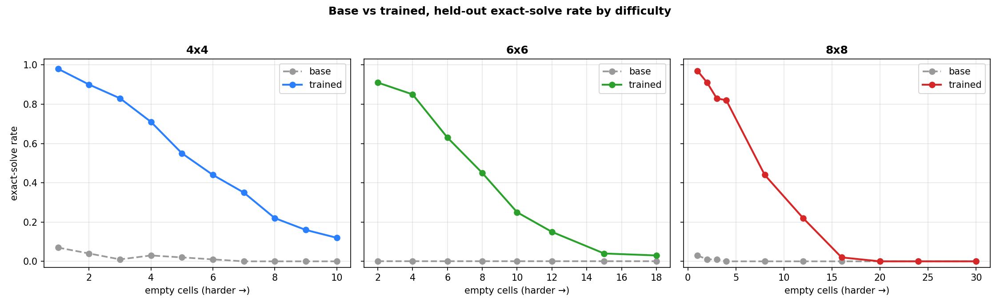
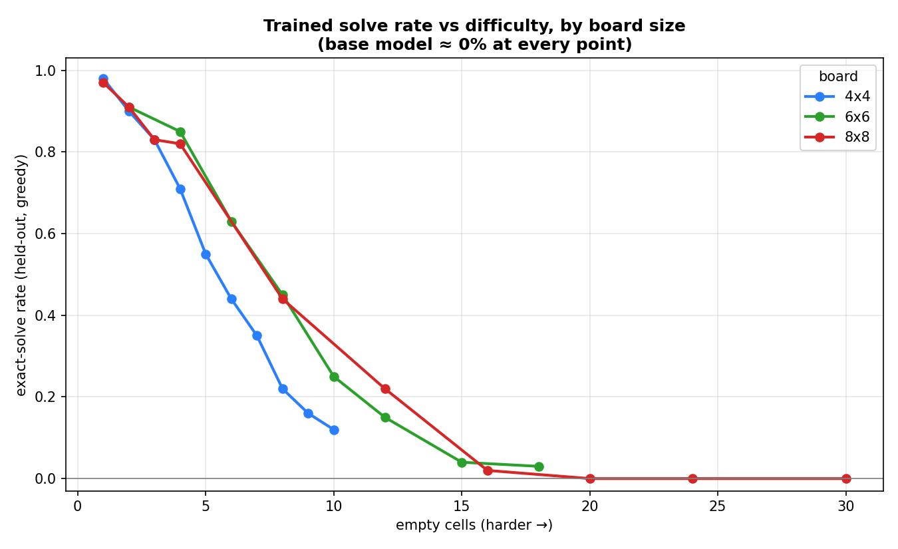
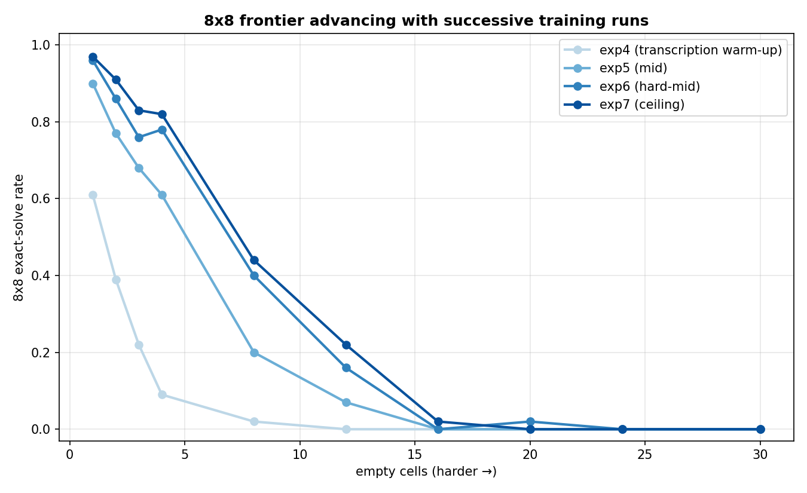

# Results

Final results across all board sizes, with the base model as the comparison point. The
chronological run-by-run account is in [EXPERIMENTS.md](EXPERIMENTS.md); the method is in
[METHODOLOGY.md](METHODOLOGY.md). All numbers are exact-solve rate on 100 held-out
puzzles per difficulty cell, greedy decoding, disjoint from training.

## Base vs trained

The base model solves almost nothing: a few percent on near-complete 4×4 grids, 0%
everywhere else. After per-size difficulty curricula it solves the easy end of every
size and declines smoothly toward the minimal-clue end.

| empty cells | 4×4 base→trained | 6×6 base→trained | 8×8 base→trained |
|---|---|---|---|
| 1 | 7% → 98% | – | 3% → 97% |
| 2 | 4% → 90% | 0% → 91% | 1% → 91% |
| 4 | 3% → 71% | 0% → 85% | 0% → 82% |
| 6 | 1% → 44% | 0% → 63% | – |
| 8 | 0% → 22% | 0% → 45% | 0% → 44% |
| 10 | 0% → 12% | 0% → 25% | – |
| 12 | – | 0% → 15% | 0% → 22% |
| 15–16 | – | 0% → 4% | 0% → 2% |
| 18+ | – | 0% → 3% | 0% → 0% |

Full table: [`../results/frontier.md`](../results/frontier.md).

## Frontier across sizes

Plotted by absolute empty-cell count, the curves cross: at a fixed number of empty cells,
a larger board is easier (8 empty cells in a 64-cell 8×8 is a smaller fraction than 8 of
16 in a 4×4), so 8×8 at 8 empty (44%) beats 4×4 at 8 empty (22%). Each size still falls
to ~0% once enough cells are removed.

## Findings

- **A difficulty curriculum is necessary.** Training directly on full-size boards fails
  because the base model never solves them, so GRPO gets no signal. Starting at a
  difficulty the base model can occasionally solve and ramping up is what works.
- **For 8×8, transcription is the prerequisite.** The base model cannot reliably copy a
  64-cell grid (givens preserved in ~3% of completions), so it cannot solve even trivial
  8×8. A 0-empty copy warm-up fixed transcription (givens-preserved 3% → 100%, format
  ~50% → 100%) and unlocked solving — 8×8 at 1 empty went from 3% to 97%.
- **The frontier scales with training budget, up to a wall.** Successive resumed runs
  kept extending the solvable range; 8×8 needed several (see below), 6×6 essentially one.

  

- **There is a hard ceiling at the minimal-clue end of every size**, which more training
  and a larger reasoning budget do not move. These puzzles require backtracking search
  that the model does not perform reliably through chain-of-thought.

## Limitations

- Single runs on one GPU; not multi-seed benchmarks.
- The minimal-clue end of every size stays at ~0%.
- The reward checks only the final grid, so a higher solve rate does not imply the
  intermediate reasoning is correct.
